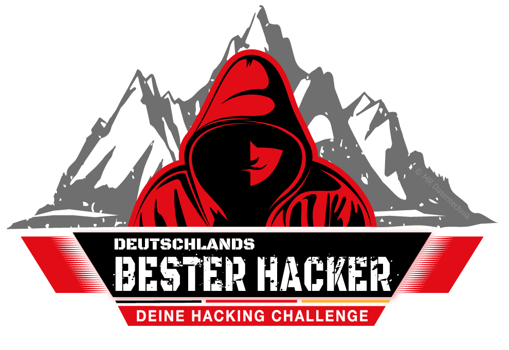

# Stats

  
  

## 2025

### Programming Projects

- <a href="https://github.com/d41y/pydle" target="_blank">pydle</a>: Minimalistic Wordle rebuild in German.
- <a href="https://github.com/d41y/Task-CLI" target="_blank">Task-CLI</a>: Terminal based task manager / to-do list.

### Challenges / Modules

| Type | Category | Name | Difficulty | Website | URL | Date |
| ---- | -------- | ---- | ---------- | ------- | --- | ---- |
| Machine | Linux | Giveback | medium | HTB | https://app.hackthebox.com/machines/796 |
| Machine | Linux | Conversor | easy | HTB | https://app.hackthebox.com/machines/787 | 25.10.2025 |
| Machine | Linux | Shakabrah | easy | OffSec | https://portal.offsec.com/machine/shakabrah-369 | 24.10.2025 |
| Module | CPTS | Linux Privilege Escalation | easy | HTB | https://academy.hackthebox.com/module/details/51 | 23.10.2025 | 
| Machine | Windows | Signed | medium | HTB | https://app.hackthebox.com/machines/775 | 12.10.2025 |
| Machine | Windows | DarkZero | hard | HTB | https://app.hackthebox.com/machines/754 | 05.10.2025 |
| Machine | Linux | Seppuku | easy | OffSec | https://portal.offsec.com/machine/seppuku-384 | 04.10.2025 |
| Machine | Linux | Katana | easy | OffSec | https://portal.offsec.com/machine/katana-344 | 04.10.2025 |
| Machine | Linux | FunboxEasy | easy | OffSec | https://portal.offsec.com/machine/cybersploit1-425 | 04.10.2025 |
| Machine | Linux | CyberSploit1 | easy | OffSec | https://portal.offsec.com/machine/funboxeasy-497 | 03.10.2025 |
| Machine | Linux | Potato | easy | OffSec | https://portal.offsec.com/machine/potato-445 | 03.10.2025 |
| Challenge | OSINT | The Puppet Master | very easy | HTB | https://app.hackthebox.com/challenges/977 | 01.10.2025 |
| Machine | Linux | Guardian | hard | HTB | https://app.hackthebox.com/machines/703 | 01.10.2025 |
| Machine | Linux | Imagery | medium | HTB | https://app.hackthebox.com/machines/751 | 30.09.2025 |
| Module | CPTS | Active Directory Enumeration & Attacks | medium | HTB | https://academy.hackthebox.com/module/details/143 | 27.09.2025 |
| Machine | Linux | Archangel | easy | THM | https://tryhackme.com/room/archangel | 26.09.2025 |
| Machine | Linux | Expressway | easy | HTB | https://app.hackthebox.com/machines/Expressway | 21.09.2025 |
| Machine | Linux | HackNet | medium | HTB | https://app.hackthebox.com/machines/HackNet | 20.09.2025 |
| Challenge | OSINT | Social Media Investigation Hub | very easy | HTB | https://app.hackthebox.com/challenges/975 | 14.09.2025 |
| Machine | Linux | Soulmate | easy | HTB | https://app.hackthebox.com/machines/Soulmate | 07.09.2025 |
| Module | CPTS | Attacking Common Services | medium | HTB | https://academy.hackthebox.com/module/details/116 | 04.09.2025 |
| Machine | Linux | Strutted | medium | HTB | https://app.hackthebox.com/machines/Strutted | 26.08.2025 |
| Module | ICS | Attacking ICS Plant #2 | medium | THM | https://tryhackme.com/room/attackingics2 | 25.08.2025 |
| Module | ICS | Attacking ICS Plant #1 | easy | THM | https://tryhackme.com/room/attackingics1 | 24.08.2025 |
| Machine | Linux | Rabbit Store | medium | THM | https://tryhackme.com/room/rabbitstore | 24.08.2025 |
| Machine | Linux | Previous | medium | HTB | https://app.hackthebox.com/machines/Previous | 23.08.2025 |
| Challenge | Web | IntroToBurp | easy | picoCTF | https://play.picoctf.org/practice/challenge/419 | 23.08.2025 |
| Challenge | Web | Insp3ctor | easy | picoCTF | https://play.picoctf.org/practice/challenge/18 | 23.08.2025 |
| Challenge | Web | Includes | easy | picoCTF | https://play.picoctf.org/practice/challenge/274 | 23.08.2025 |
| Challenge | Web | Cookies | easy | picoCTF | https://play.picoctf.org/practice/challenge/173 | 23.08.2025 |
| Module | CPTS | Pivoting, Tunneling, And Port Forwarding | medium | HTB | https://academy.hackthebox.com/module/details/158 | 23.08.2025 |
| Challenge | Web | dont-use-client-side | easy | picoCTF | https://play.picoctf.org/practice/challenge/66 | 22.08.2025 |
| Challenge | Pwn | FD | easy | pwnable.kr | http://www.pwnable.kr | 22.08.2025 |
| Challenge | Web | Local Authority | easy | picoCTF | https://play.picoctf.org/practice/challenge/278 | 21.08.2025 |
| Challenge | Web | Unminify | easy | picoCTF | https://play.picoctf.org/practice/challenge/426 | 21.08.2025 |
| Challenge | Web | Cookie Monster Secret Recipe | easy | picoCTF | https://play.picoctf.org/practice/challenge/469 | 21.08.2025 | 
| Challenge | Pwn | Getting Started | very easy | HTB | https://ctf.hackthebox.com/event/1434 | 21.08.2025 | 
| Challenge | Web | head-dump | easy | picoCTF | https://play.picoctf.org/practice/challenge/476 | 20.08.2025 |
| Challenge | Web | n0s4n1ty 1 | easy | picoCTF | https://play.picoctf.org/practice/challenge/482 | 20.08.2025 |
| Challenge | Web | SSTI1 | easy | picoCTF | https://play.picoctf.org/practice/challenge/492 | 20.08.2025 |
| Challenge | OSINT | The Suspicious Domain | very easy | HTB| https://app.hackthebox.com/challenges/973 | 20.08.2025 |
| Challenge | OSINT | The Suspicious Reviewer | very easy | HTB| https://app.hackthebox.com/challenges/972 | 20.08.2025 |

### CTFs

#### Deutschlands Bester Hacker - Qualifier

**Platz**: 26
